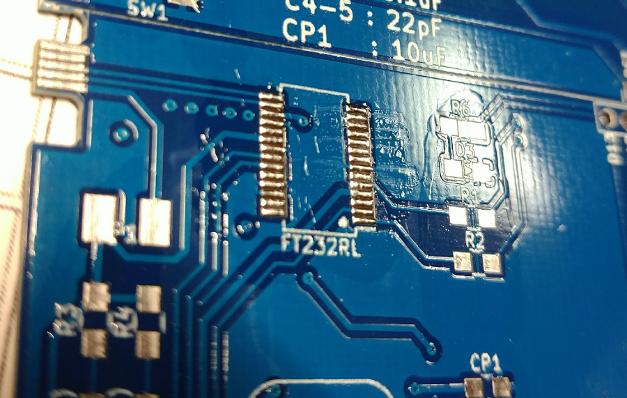

# Arduino Name Card
[日本語版 README](./README_JP.md)  
This is template what compatible board of Arduino uno.
masterは1枚のみであり，91×55mmの名刺サイズで作成しています.  

もし, 2枚の面付け基板として作成したい場合は，
[twoBoards](https://github.com/MaruTama/ArduinoNameCard/tree/twoBoards)ブランチを参照してください.


sample code の blink を書き込んだもの


# 環境バージョン
- KiCad 4.0.7
- ArduinoIDE 1.8.2
- GIMP 2.8
- Ubuntu 16.04 and macOS High Sierra (当方)

基本的に ArduinoIDE と KiCad, GIMP はクロスプラットフォームで OS 依存しないので， OS は問いません.

# 環境構築方法
## ArduinoIDEのインストール
### windows
直接公式からダウンロードのダウンロードに時間がかかることがあったので,
Chocolateyでインストールするのがオススメです.

Chocolateyのインストールは,
["Chocolateyを使った環境構築の時のメモ"](https://qiita.com/konta220/items/95b40b4647a737cb51aa)
を参照してください.

管理者権限でcmd or PowerShellを開き, ArduinoIDEのインストールします.

```
> choco upgrade chocolatey
> choco install arduino
```

2回質問が来るのですが "Yes" で構いません.


ドライバーをインストールするか数回問われるので, すべてインストールします.


### mac
macはbrewでインストール

```.sh
brew cask install arduino
```

### Ubuntu
["ここ"](https://www.arduino.cc/en/Main/Software)から，最新のlinux 32 or 64.zipをダウンロードします.    
ダウンロードしたファイルが arduino-1.8.2-linux64.tar.xz の時のインストール方法は以下のとおりです.

```.sh
$ sudo tar -Jxvf arduino-1.8.2-linux64.tar.xz -C /usr/share
$ cd /usr/share
$ sudo mv arduino-1.8.2/ arduino
# シンボリックリンクを作成
$ sudo ln -s /usr/share/arduino/arduino /usr/local/bin/arduino
# 実行
$ arduino
# もしポートが使えないときは管理者権限で実行する
$ sudo arduino
```


## Kicadのインストール
### windows
#### choco でインストール
chocoでのインストールする場合は次のコマンドを実行します

```.sh
> choco upgrade chocolatey
> choco install kicad
```
#### インストーラーでインストール
インストーラーを用いてインストールする場合は，下記の公式サイトからインストーラーをダウンロードします.  
[http://kicad-pcb.org/download/windows/](http://kicad-pcb.org/download/windows/)

### mac
インストーラーを用いてインストールする場合は，下記の公式サイトからインストーラーをダウンロードします.  
"KiCad main package"は，ライブラリをgithubに置いているもの.  
"KiCad extras"は，ライブラリをローカルに置くもの.  
[http://kicad-pcb.org/download/osx/](http://kicad-pcb.org/download/osx/)

### ubuntu
次のコマンドを実行します.


```.sh
$ sudo add-apt-repository --yes ppa:js-reynaud/kicad-4
$ sudo apt update
$ sudo apt install kicad
```

## Kicadの設定
### コンポーネントライブラリ
コンポーネントライブラリは「〜.libファイル」で，そのファイル中に各コンポーネントが内包されています  

コンポーネントライブラリのパス  

| Component library files | User defind search path |
|:------------|:--------------|
| res/lib/ArduinoNameCard.lib | res/lib |

### フットプリントライブラリ
フットプリントライブラリは「〜.pretty」というフォルダで，各フットプリントのファイル「.kicad_mod」が入っています  

フットプリントのライブラリのパス

| nickname | path |
|:------------|:--------------|
| ArduinoNameCard | ${KIPRJMOD}/res/lib/ArduinoNameCard.pretty |

### kicadライブラリ

基本的にチップ部品は, 次のサイズに統一しています

|   EIA  |   JIS  |
|:-------|:-------|
| 0805 | 2012 |

FT232RL.libに関しては,
["Quick KICAD Library Component Builder"](http://kicad.rohrbacher.net/quicklib.php)というサービスにて作成しました.  

ATMEGA328-AUのライブラリは, ["ここ"](https://www.snapeda.com/parts/ATMEGA328-AU/Atmel/view-part/)からダウンロードしました.  


## Arduino 名刺を製作する
画像からPCBのフットプリントを作成します．

### 1.名刺上の空き領域のサイズに合わせて画像を作成する
gimp で新規作成を行ないます. dpiは1000程度にします.  


今回使用した画像は リポジトリの[./res/img/origin](https://github.com/MaruTama/ArduinoNameCard/tree/master/res/img/origin) に置いてあります.
これを利用してください.
各画像は, 次のことを書き込むことを想定しています.
- affiliation.png　-> 所属
- name.png 　　-> 名前
- address.png  -> 連絡先


### 2.画像に図や文字を入力します
例として, name.png に名前を書き込みます.  
もし, カラーの場合は画像を二値化します.  


### 3.黒地白字にします
白地黒字のときには下図ようにgimpでは「階調の反転」で黒地白字にできます.   


### 4.フットプリントを作成します
基板に載せる情報について, **シルク** か **銅箔の剥き出し** か選ぶ事ができます.  
シルクで載せた場合は下図の　affiliation.png のようになります.  
銅箔の剥き出しにした場合は　name.png　と address.png のようになります.  


bimmpa to componentを起動します.  


　シルクを作成する場合 　　　--> 5へ  
　銅箔剥き出しで作成する場合  --> 6へ  

### 5.シルクで作成します
Load Bitmap で　画像を読み込みます. 例として今回は, name.png を読み込みました.  
Resolutionが1000dpi程度であることを確認します.  

「Front silk screen」にチェックを入れます.  
「Export」でファイル(name_silk.kicad_mod)を出力します.  


### 6.銅箔で作成します
Load Bitmap で　画像を読み込みます. 今回は, name.png を読み込みました.  
Resolutionが1000dpi程度であることを確認します.  

「Front solder mask」にチェックを入れます.
「Export」でファイル(name_mask.kicad_mod)を出力します.  


出力したname_mask.kicad_modのフットプリントを加工します.  
具体的にはレジストマスクと銅箔のフットプリントにします.  

スクリプトはpythonで記述されています.  
リポジトリの [./python/main.py](https://github.com/MaruTama/ArduinoNameCard/blob/master/python/main.py) にスクリプトが置いてあります.  
次のコマンドを実行するとフットプリントが作成されます.  

```.sh
$ cd 本プロジェクトのルート
$ python python/main.py  res/lib/ArduinoNameCard.pretty/name_mask.kicad_mod
```
すると, name_mask_and_cu.kicad_mod が生成されます.  

(もし，生成されない場合は，name_cu.kicad_modを開き "fp_ploy" 以降に含まれる項目をコピーしておき，"F.Mask" を "F.Cu"に置換後， コピーした内容を追記してname_mask_and_cu.kicad_modとして保存してください.)  

### 7.フットプリントをライブラリに追加する
作業ライブラリとしてArduinoNameCardを選択します.  


先ほど，出力したファイルを読み込みます.  


ライブラリにコンポーネントを保存する.  
シルクで作成している場合は，name_silkとして保存します.  
銅箔で作成している場合は, name_mask_and_cuとして保存します.  


### 8.基板上に展開します
すでにあるフットプリントを置換するのが一番楽です.  
置換したいフットプリント上で右クリックし,
フットプリントの交換 -> フットプリント G*** でウィンドウが開きます.  


フットプリントのリストを押して、保存したフットプリントを選択します.  


適用を押すとフットプリントが変更されます.  


### 9.GNDのベタ塗りをします
四角い場所をクリックします.  


基板上の任意の箇所で右クリックすると次のようなメニューが出てきます.  
[全てのゾーンを塗りつぶす]を選択します.  


これでベタ塗り完了です.  

### 10.確認
view -> 3D viewer で3Dビューアーで確認できます.  


## 基板を発注する
### ガーバーデータの作成
ガーバーの作成方法は, [★kicad (Mac OSX Version: 4.0.5 release build)版でFusionPCB用ガーバーデータの作り方．](http://atmel.client.jp/fusionpcb.html)を参照してください.    

file -> plot でgerverの出力をします.  


ドリルデータを出力します.  


#### ガーバーデータのリネーム
gerver データを ArduinoNameCard にリネームします.  


#### ガーバーデータのzipを作成する
exportフォルダごと圧縮して, zipにまとめます.  
zipのファイル名は,ArduinoNameCardにリネームします.  

### 基板の発注設定
seeed fusion のプレビューで確認できます.  
好きな色を選択します.  


基板の厚みは**0.6mm**で注文します.  

## 部品を発注する
serial変換部分

| 部品 | １枚で使用する個数 | 秋月またはDigKeyでの値段 |
|:------------|:--------------|:----------------|
| [FT232RL](http://akizukidenshi.com/catalog/g/gI-01739/)  | 1 | ¥400 |
| [1kΩ](http://akizukidenshi.com/catalog/g/gR-11796/)  | 2 | ¥100 |
| [0.1µF](http://akizukidenshi.com/catalog/g/gP-00355/)| 2 | ¥150 |
| [10µF](http://akizukidenshi.com/catalog/g/gP-07388/) | 1 | ¥150 |
| [赤LED](http://akizukidenshi.com/catalog/g/gI-06419/)| 1 | ¥150 |
| [緑LED](http://akizukidenshi.com/catalog/g/gI-06492/)| 1 | ¥150 |

Arduino互換部分

| 部品 | １枚で使用する個数 | 秋月またはDigKeyでの値段 |
|:------------|:--------------|:----------------|
| [ATMEGA328P-AU](http://akizukidenshi.com/catalog/g/gI-04386/)  | 1 | ¥230 |
| [水晶発振子 16MHz](http://akizukidenshi.com/catalog/g/gP-08671/) | 1 | ¥30 |
| [10kΩ](http://akizukidenshi.com/catalog/g/gR-11797/) | 1 | ¥100 |
| [1kΩ](http://akizukidenshi.com/catalog/g/gR-11796/)  | 2 | ¥100 |
| [330Ω](https://www.digikey.jp/product-detail/ja/stackpole-electronics-inc/RMCF0805JT330R/RMCF0805JT330RCT-ND/1942547) | 1 | ¥19 |
| [0.1µF](http://akizukidenshi.com/catalog/g/gP-00355/)| 1 | ¥150 |
|  [22pF](https://www.digikey.jp/product-detail/ja/murata-electronics-north-america/GRM21A5C2E220JW01D/490-5534-1-ND/2334930)          | 2 | ¥295 |
| [ヒューズ](http://akizukidenshi.com/catalog/g/gP-12636/)          | 1 | ¥200 |
| [赤LED](http://akizukidenshi.com/catalog/g/gI-06419/)| 1 | ¥150 |
| [タクトスイッチ](http://akizukidenshi.com/catalog/g/gP-06185/) | 1 | ¥100 |

## ブートローダーの書き込み
書き込みの方法は，optifixで書き込みます.  
手順に関しましては, ["【Arduino 1.6.3】 Arduino UnoでATmega328P-PUにブートローダを書き込む"](http://ijmp320.hatenablog.jp/entry/2015/05/16/121922)を参照してください  

当方では，["ICソケット"](http://www.aitendo.com/product/15796)を用いて，はんだ付けよりも先に書き込みを行っています.  

次の組み合わせでArduinoUNOとATMEGA328P-AUを接続します.  

| Arduino UNO | ATMEGA328P-AU | 名刺（基板）での位置 |
|:------------|:--------------|:----------------|
| D10 (SS)    | 29 (RESET)    | RST |
| D11 (MOSI)  | 15 (MOSI)     | D11 |
| D12 (MISO)  | 16 (MISO)     | D12 |
| D13 (SCK)   | 17 (SCK)      | D13 |
| 5V          | 4 or 6        | 5V  |
| GND         | 3 or 5        | GND |

## はんだ付け
FT232RLはピン間が狭く，はんだ付けするのが困難です.  
普通にはんだ付けもできますが，次のような手順で行うことを推奨します.  

### 1. フラックスを多めに塗ります.


### 2. 先にランドに，軽くはんだを付けておきます.



### 3. 足を揃え，上からこてを当てて固定します.

