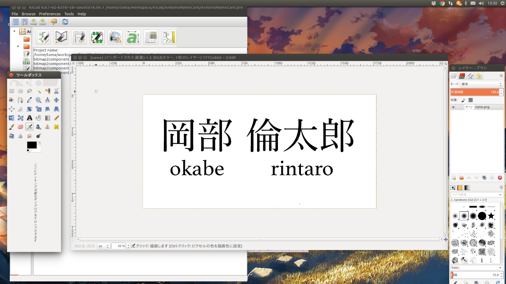
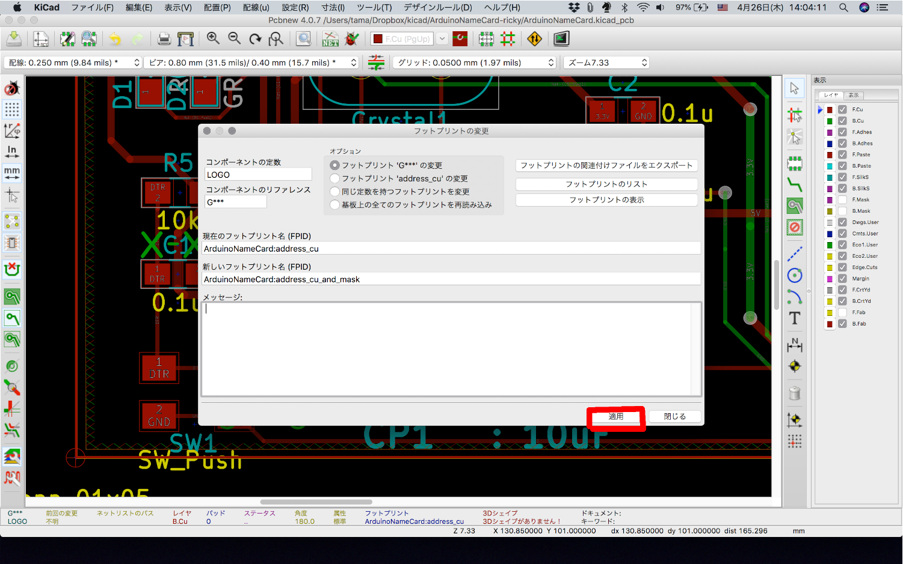
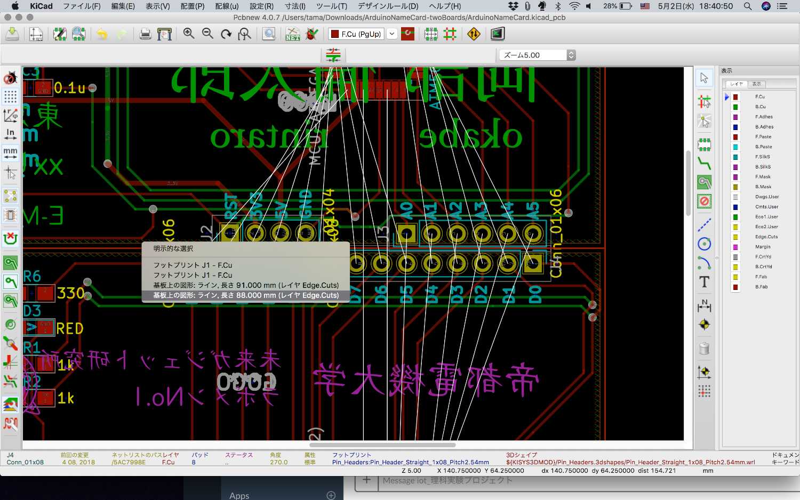
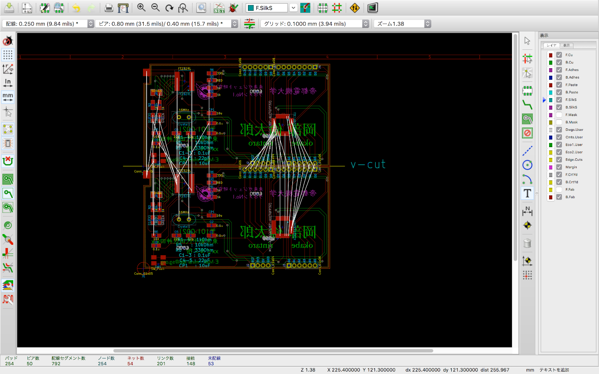
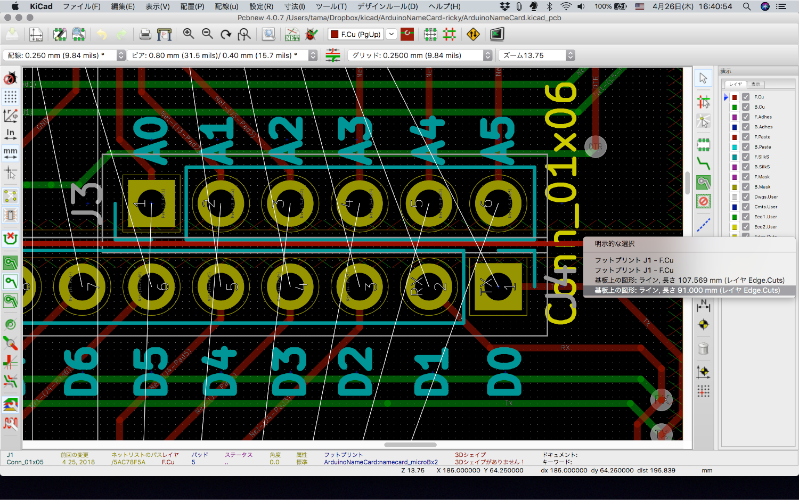
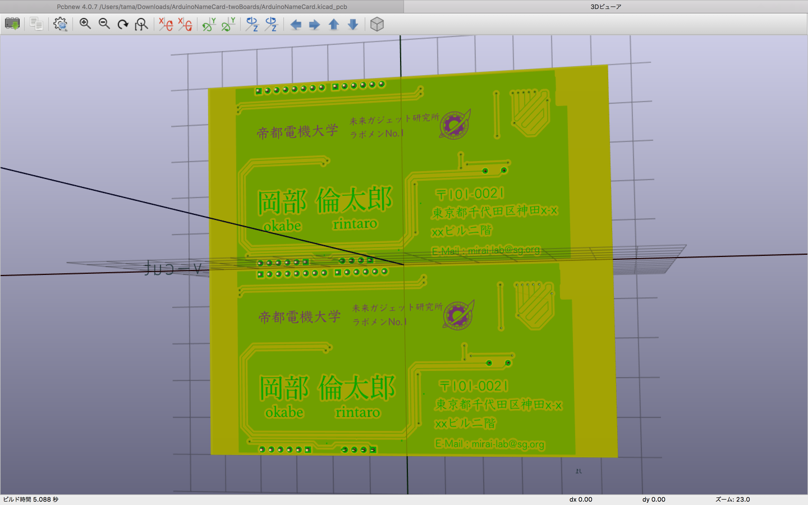
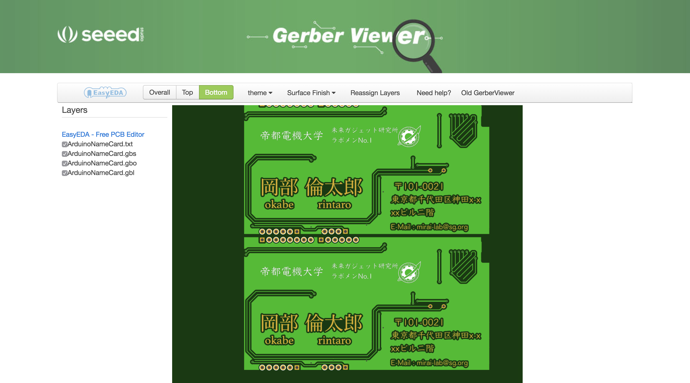
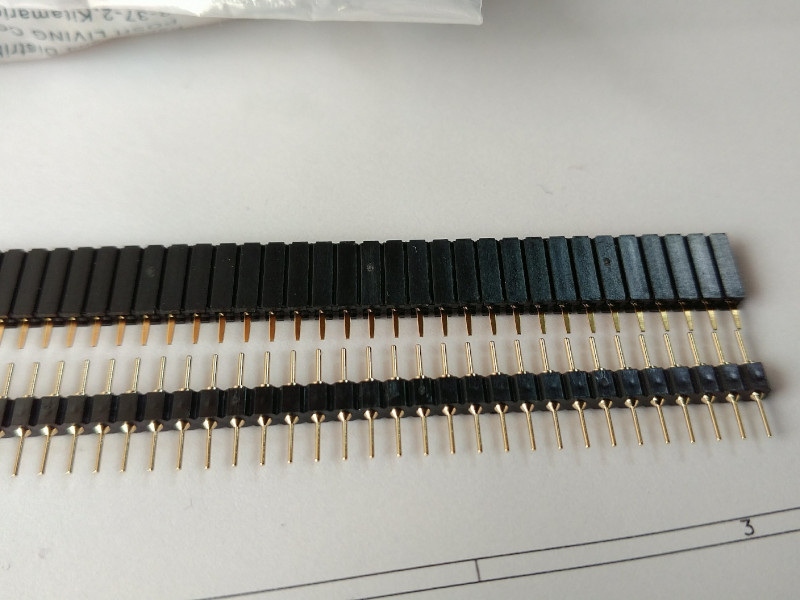
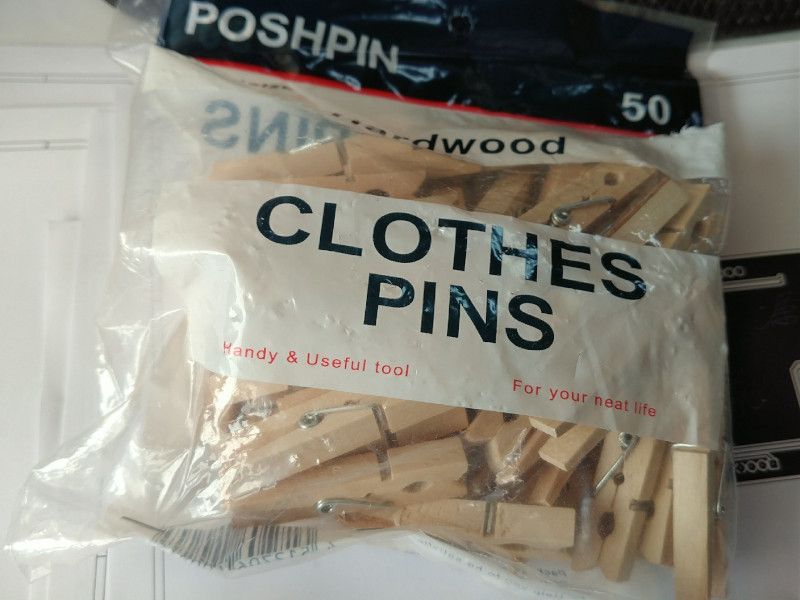

# Arduino 名刺
これはArduino uno互換基板の名刺のテンプレートです.  
twoBoardは、2枚の面付け基板として作成するものです.  100mm×100mmに収まるサイズになっています.  
  
  

# 環境バージョン
KiCad 4.0.7  
ArduinoIDE 1.8.2  
Ubuntu 16.04(当方)  
基本的にArduinoIDEとKiCadはクロスプラットフォームでOS依存しないので，OSは問いません.

# 環境構築方法
## ArduinoIDEのインストール
### windows
直接公式からダウンロードのダウンロードに時間がかかることがあったので,  
Chocolateyでインストールするのがオススメです.

Chocolateyのインストールは,
["Chocolateyを使った環境構築の時のメモ"](https://qiita.com/konta220/items/95b40b4647a737cb51aa)
を参照してください.


管理者権限でcmd or PowerShellを開き, ArduinoIDEのインストールします.

```
> choco upgrade chocolatey
> choco install arduino
```

2回質問が来るのですが "Yes" で構いません.


ドライバーをインストールするか数回問われるので, すべてインストールします.


### mac
macはbrewでインストール
```
brew cask install arduino
```

### Ubuntu
["ここ"](https://www.arduino.cc/en/Main/Software)から，最新のlinux 32 or 64.zipをダウンロードします.    
ダウンロードしたファイルが arduino-1.8.2-linux64.tar.xz の時のインストール方法は以下のとおりです.
```
$ sudo tar -Jxvf arduino-1.8.2-linux64.tar.xz -C /usr/share
$ cd /usr/share
$ sudo mv arduino-1.8.2/ arduino
# シンボリックリンクを作成
$ sudo ln -s /usr/share/arduino/arduino /usr/local/bin/arduino
# 実行
$ arduino
# もしポートが使えないときは管理者権限で実行する
$ sudo arduino
```


## Kicadのインストール
### windows

chocoでのインストールする場合は次のコマンドを実行します
```
> choco upgrade chocolatey
> choco install kicad
```

インストーラーを用いてインストールする場合は，下記の公式サイトからインストーラーをダウンロードします.  
[http://kicad-pcb.org/download/windows/](http://kicad-pcb.org/download/windows/)

### mac
インストーラーを用いてインストールする場合は，下記の公式サイトからインストーラーをダウンロードします.  
"KiCad main package"は，ライブラリをgithubに置いているもの.  
"KiCad extras"は，ライブラリをローカルに置くもの.  
[http://kicad-pcb.org/download/osx/](http://kicad-pcb.org/download/osx/)

### ubuntu
次のコマンドを実行します.
```
$ sudo add-apt-repository --yes ppa:js-reynaud/kicad-4
$ sudo apt update
$ sudo apt install kicad

```

## Kicadの設定
コンポーネントライブラリは「〜.libファイル」で，そのファイル中に各コンポーネントが内包されています  

コンポーネントライブラリのパス  

| Component library files | User defind search path |
|:------------|:--------------|
| res/lib/ArduinoNameCard.lib | res/lib |

フットプリントライブラリは「〜.pretty」というフォルダで，各フットプリントのファイル「.kicad_mod」が入っています  

フットプリントのライブラリのパス

| nickname | path |
|:------------|:--------------|
| ArduinoNameCard | ${KIPRJMOD}/res/lib/ArduinoNameCard.pretty |

### kicadライブラリ

基本的にチップ部品は, 次のサイズに統一しています

|   EIA  |   JIS  |
|:-------|:-------|
| 0805 | 2012 |

FT232RL.libに関しては,
["Quick KICAD Library Component Builder"](http://kicad.rohrbacher.net/quicklib.php)というサービスにて作成しました

ATMEGA328-AUのライブラリは, ["ここ"](https://www.snapeda.com/parts/ATMEGA328-AU/Atmel/view-part/)からダウンロードしました


## 名前等を挿入する
画像からPCBのフットプリントを作成します．

**1.名刺上の空き領域のサイズに合わせて画像を作成する**  
dpiは1000程度にします  
今回使用した画像は./res/img/origin に置いてあります  
  

**2.画像に図や文字を入力します**  
  

**3.もし，カラーの場合は画像を二値化します**  

**4.黒地白字にします**  
白地黒字のときには下図ようにgimpでは「階調の反転」で黒地白字にできます．
  

**5.フットプリントを作成します**  
bimmpa to componentを起動します  
  
　シルクを作成する場合 --> 6へ  
　銅箔で作成する場合  --> 7へ  

**6.シルクで作成します**  
Resolutionが1000dpi程度であることを確認します  
「Front silk screen」にチェックを入れます  
「Export」でファイル(name_silk.kicad_mod)を出力します  
  

**7.銅箔で作成します**  
Resolutionが1000dpi程度であることを確認します  
「Front solder mask」にチェックを入れます  
「Export」でファイル(name_mask.kicad_mod)を出力します  
  

出力したname_mask.kicad_modのフットプリントを加工します  
具体的にはレジストマスクと銅箔のフットプリントにします  

スクリプトはpythonで記述されています．  
次のコマンドを実行するとフットプリントが作成されます

```
$ cd 本プロジェクトのルート
$ python python/main.py  res/lib/ArduinoNameCard.pretty/name_mask.kicad_mod
```
すると，　name_mask_and_cu.kicad_mod が生成されます    

(もし，生成されない場合は，name_cu.kicad_modを開き "fp_ploy" 以降に含まれる項目をコピーしておき，"F.Mask" を "F.Cu"に置換後，コピーした内容を追記してname_mask_and_cu.kicad_modとして保存する)  


**8.フットプリントをライブラリに追加する**  
作業ライブラリとしてArduinoNameCardを選択します  
  

先ほど，出力したファイルを読み込みます  
  

ライブラリにコンポーネントを保存する  
シルクで作成している場合は，name_silkとして保存します  
銅箔で作成している場合は, name_mask_and_cuとして保存します  
  

**9.基板上に展開します**  
すでにあるフットプリントを置換するのが一番楽です  
置換したいフットプリント上で右クリックして  
フットプリントの交換 -> フットプリント G*** でウィンドウが開きます    
  
フットプリントのリストを押して、保存したフットプリントを選択します  
  
適用を押すとフットプリントが変更されています  
  

**10.GNDのベタ塗りをします**  
  

**11.面付けにする**  

基板を範囲選択します
　　

ピッタリ基板同士が揃う位置を見つけたら、右クリック -> ブロックをコピー で基板を複製します．  
  

重なっている枠線は不要であるため削除します  
右クリック -> 図形の削除 で削除できます（削除する図形はどちらでも構いません）
  

2つの基板間にを突き抜ける枠線(Edge.Cuts)を引きます.  
  

先ほど引いた枠線の隣にシルクで"v-cut"を記述します.  
  
  

再度、重なっている枠線を削除します．  
今回は短い方の枠線を削除します.  


**12.確認**  
view -> 3D viewer で3Dビューアーで確認できます   
  


## 基板を発注する
ガーバーの作成方法は, [★kicad (Mac OSX Version: 4.0.5 release build)版でFusionPCB用ガーバーデータの作り方．](http://atmel.client.jp/fusionpcb.html)を参照してください  

file -> plot でgerverの出力をします  
  

ドリルデータを出力します  
  

gerverデータをリネームします  
  

exportフォルダごと圧縮して, zipにまとめます

seeed fusion のプレビューで確認できます  
好きな色を選択します  
  
  

面付け基板の場合は厚みは**0.8mm**で注文します

## 部品を発注する
serial変換部分

| 部品 | １枚で使用する個数 | 秋月またはDigKeyでの値段 |
|:------------|:--------------|:----------------|
| [FT232RL](http://akizukidenshi.com/catalog/g/gI-01739/)  | 1 | ¥400 |
| [1kΩ](http://akizukidenshi.com/catalog/g/gR-11796/)  | 2 | ¥100 |
| [0.1µF](http://akizukidenshi.com/catalog/g/gP-00355/)| 2 | ¥150 |
| [10µF](http://akizukidenshi.com/catalog/g/gP-07388/) | 1 | ¥150 |
| [赤LED](http://akizukidenshi.com/catalog/g/gI-06419/)| 1 | ¥150 |
| [緑LED](http://akizukidenshi.com/catalog/g/gI-06492/)| 1 | ¥150 |

Arduino互換部分

| 部品 | １枚で使用する個数 | 秋月またはDigKeyでの値段 |
|:------------|:--------------|:----------------|
| [ATMEGA328P-AU](http://akizukidenshi.com/catalog/g/gI-04386/)  | 1 | ¥230 |
| [水晶発振子 16MHz](http://akizukidenshi.com/catalog/g/gP-08671/) | 1 | ¥30 |
| [10kΩ](http://akizukidenshi.com/catalog/g/gR-11797/) | 1 | ¥100 |
| [1kΩ](http://akizukidenshi.com/catalog/g/gR-11796/)  | 2 | ¥100 |
| [330Ω](https://www.digikey.jp/product-detail/ja/stackpole-electronics-inc/RMCF0805JT330R/RMCF0805JT330RCT-ND/1942547) | 1 | ¥19 |
| [0.1µF](http://akizukidenshi.com/catalog/g/gP-00355/)| 1 | ¥150 |
|  [22pF](https://www.digikey.jp/product-detail/ja/murata-electronics-north-america/GRM21A5C2E220JW01D/490-5534-1-ND/2334930)          | 2 | ¥295 |
| [ヒューズ](http://akizukidenshi.com/catalog/g/gP-12636/)          | 1 | ¥200 |
| [赤LED](http://akizukidenshi.com/catalog/g/gI-06419/)| 1 | ¥150 |
| [タクトスイッチ](http://akizukidenshi.com/catalog/g/gP-06185/) | 1 | ¥100 |

## ブートローダーの書き込み
書き込みの方法は，["ATMEGA328P を Arduino として使う"](https://ht-deko.com/arduino/atmega328p.html)を参照してください  
次の組み合わせでArduinoUNOと名刺基板を接続します  

| Arduino UNO | ATMEGA328P-AU | 名刺（基板）での位置 |
|:------------|:--------------|:----------------|
| D10 (SS)    | 29 (RESET)    | RST |
| D11 (MOSI)  | 15 (MOSI)     | D11 |
| D12 (MISO)  | 16 (MISO)     | D12 |
| D13 (SCK)   | 13 (SCK)      | D13 |
| 5V          | 4 or 6        | 5V  |
| GND         | 3 or 5        | GND |

## 出力端子クリップの作成
ただ，これは通電していないピンがあるときがあるので要注意．  
対処法は思案中です.  

丸ピンの片側を切ります


１００均で買った洗濯バサミに穴を開けます


開けた穴に丸ピンとメスコネクタを差し込み，ハンダ付けします


このようにハンダ付けしなくてもポートを使うことができます

